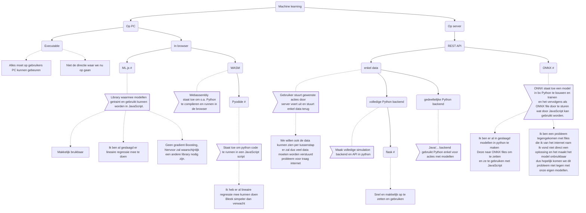

# algemeen

## probleem

Machine learning modellen bouwen, trainen en gebruiken.
De data moet bruikbaar zijn op een simpele computer met mogelijk slecht internet. Er moet dus gezocht worden naar een manier om oftewel machine learning te doen in een browser oftewel op een server en de nodige data zo efficiënt mogelijk over te zetten.

## flowchart

Flowchart laat mogelijk niet toe om in te zoomen

[Download meer gebruiksvindelijke flowchart](downloadables/mogelijkheden_flowchart_zoom.svg){:download="flowchart_machine_learning"}
